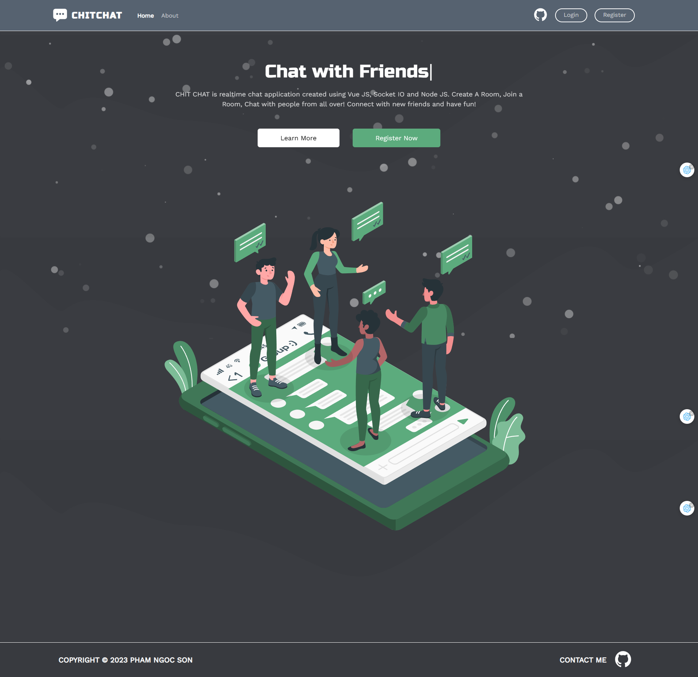
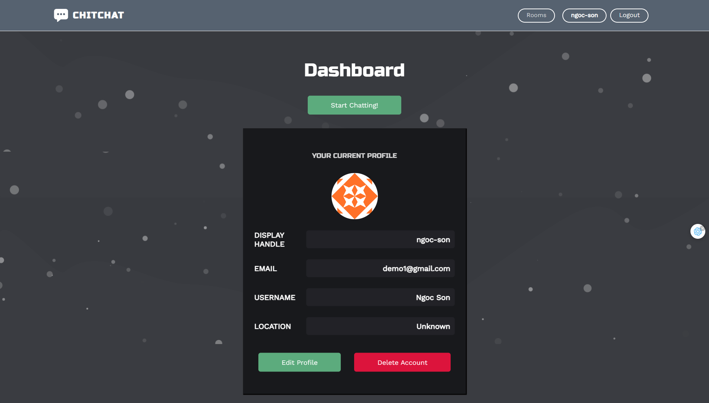
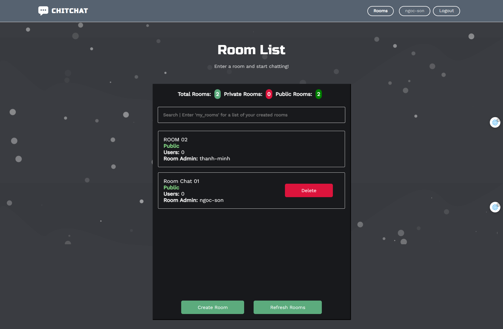
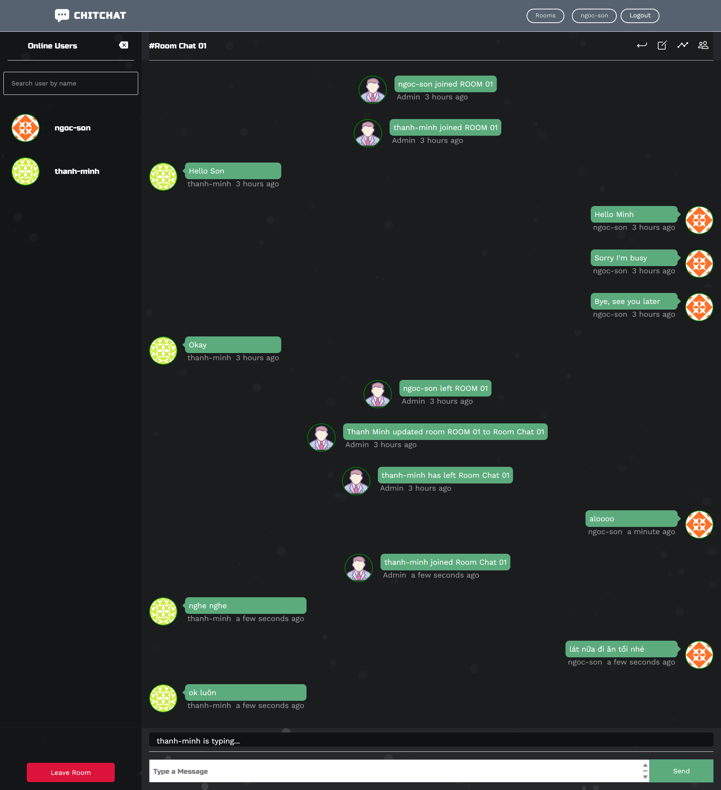

# CHIT CHAT
## Chit Chat Is Realtime Application

## Table of Contents
* [Demo](#demo)
* [Technologies And Packages Used](#mag_righttechnologies-and-packages-used)
* [Features](#pencilfeatures)
* [Screenshots](#camerascreenshots)
* [Setup](#wrenchsetup)

## Demo
[Live Demo](https://chit-chat-bay.vercel.app/) <br>
__You can use test account for the website__
* __Account 1__: <br>
email: test1acc@mail.com, <br>
password: testing123
* __Account 2__: <br>
email: test2acc@mail.com, <br>
password: testing321
* __Account 3__: <br>
email: test3acc@mail.com, <br>
password: testing333
* __Account 4__: <br>
email: test4acc@mail.com, <br>
password: testing444
* __Account 5__: <br>
email: test5acc@mail.com, <br>
password: testing555
## :mag_right:Technologies And Packages Used
**Backend:** 
- NodeJS
- ExpressJS
- Socket Io
- Mongoose
- JWT
- Bcrypt

**Frontend:** 
- Vuejs
- Vuex
- Vue Router
- Socket Io Client
- Axios

## :pencil:Features
List the ready features here:
- Register
- Login With Chit Chat
- Edit Your Profile
- Create Room
- Edit Room
- Delete Room
- Search Room
- Join Room
- Chat With Another Users
- Room Notify Who Join/Leave/Update Room
- Realtime
- <del> Private Room </del> (maintance)


## :camera:Screenshots






## :wrench:Setup

- When clone my project to your computer, open it with VSCODE
- Install locally using npm, open Terminal in VSCODE:
  
```
cd to server: cd .\server\. 
install package for server: $ npm i
cd to client: cd .\client\. 
install package for client: $ npm i

```

- When after success install package for client and server, to run this project:
```
run server: $ npm run dev
run client: $ npm run dev
```
